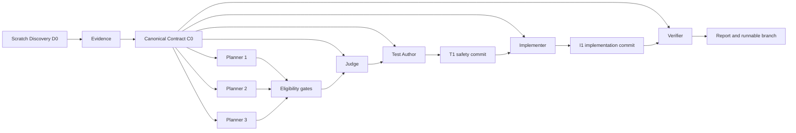

# ChangeSafely

[](https://github.com/vv-bogdanov/changesafely/actions/workflows/ci.yml)
[](https://github.com/vv-bogdanov/changesafely/actions/workflows/codeql.yml)
[](https://scorecard.dev/viewer/?uri=github.com/vv-bogdanov/changesafely)
[](LICENSE)

ChangeSafely is a local TypeScript CLI that compares independent implementation
plans, creates a protected failing-first safety harness, implements one selected
plan, and verifies the resulting Git branch from a clean Codex context.

The workflow is target-language independent by design. Current model-free end-to-end
proofs cover prepared npm JavaScript/TypeScript, Python/pytest, config-driven make, and
a Node/Python polyglot repository, plus PHP through the same explicit config. Each uses
one branch, one plan, real command exits, inspectable artifacts, and explicit safe
stops. Additional toolchains are listed only after a fixture passes.

## Why ChangeSafely

- **Alternatives before edits.** Independent planners fork from one canonical
  contract; deterministic eligibility gates run before the Judge.
- **Tests before production code.** Test Author creates and commits T1 before the
  Implementer can change production paths. T1 hashes remain protected.
- **Independent verification.** Verifier forks from C0 rather than inheriting the
  Implementer transcript and receives the actual diff and command evidence.

## Quick Start

Until the first npm registry release, install from the repository:

```sh
git clone https://github.com/vv-bogdanov/changesafely.git
cd changesafely
npm ci --ignore-scripts
npm run build
npm link
changesafely --help
```

The package is prepared for tokenless, provenance-backed npm releases. Once
`0.1.0` is published, the CLI will run without a checkout:

```sh
npx changesafely@0.1.0 --help
```

ChangeSafely uses the authenticated `codex` executable on `PATH`. A run uses one
model for every role and defaults to `gpt-5.6-sol`.

## Compatibility

| Component | Supported baseline |
| --- | --- |
| Node.js | Active LTS 22 and 24 |
| Codex CLI | Standard authenticated executable on `PATH`; generated baseline currently `0.144.6` |
| Git | Named branch, valid HEAD, clean tracked and staged state |
| Target architecture | Source-language independent; repository-owned deterministic checks |
| Validated target | Prepared npm JavaScript/TypeScript, Python/pytest, config-driven make, Node/Python polyglot, and config-driven PHP repositories |
| Host | Ubuntu, macOS, and Windows package/process smoke on Node.js 24 |

The App Server protocol is generated reproducibly from the pinned development
dependency. Runtime Codex versions are accepted when the App Server handshake and
the messages ChangeSafely actually uses pass fail-closed validation.

### Repository Checks

ChangeSafely detects prepared npm and pytest repositories. Other tools and polyglot
repositories declare the same command contract in a tracked repository-root
`changesafely.config.json`:

```json
{
  "version": 1,
  "checks": [
    { "id": "make:test", "kind": "test", "argv": ["make", "test"], "cwd": "." }
  ],
  "testPathPrefixes": ["tests"],
  "testFilePatterns": ["*_test.py"],
  "controlFiles": ["Makefile"]
}
```

Commands are argv arrays, never shell strings. The config cannot provide setup steps,
environment overrides, credentials, or deployment actions. Every cwd is
repository-relative, every additional control file must already be tracked, and the
resolved catalog and config are hashed before writes. ChangeSafely never installs the
declared runtime or project dependencies.

## Workflow



D0 and C0 are separate root threads. Planners, Judge, Test Author,
Implementer, and Verifier fork from the completed C0 checkpoint and exchange
schema-validated artifacts rather than hidden role transcripts. See
[`docs/ARCHITECTURE.md`](docs/ARCHITECTURE.md).

## CLI

Compare plans without changing tracked target state:

```sh
changesafely plan --repo /path/to/repo --task "Describe the requested change" --plans 3
```

Run the full test-first workflow:

```sh
changesafely run --repo /path/to/repo --task "Describe the requested change" --plans 3
```

Omit `--model` to use `gpt-5.6-sol`, or select one model explicitly for the whole
run. Bound the command, including all roles and deterministic checks, with `--timeout`:

```sh
changesafely run --model gpt-5.3-codex-spark --timeout 900 \
  --repo /path/to/repo --task "Describe the requested change" --plans 3
```

Resume only from a validated persisted boundary:

```sh
changesafely resume --repo /path/to/repo --run <run-id>
```

Inspect a persisted run without changing Git or artifacts:

```sh
changesafely status --repo /path/to/repo --run <run-id>
```

Inspect the ordered local execution timeline without changing the run:

```sh
changesafely trace --repo /path/to/repo --run <run-id>
changesafely trace --repo /path/to/repo --run <run-id> --json
```

`plan`, `run`, `resume`, `status`, `trace`, and `doctor` accept `--json`. Run commands emit
one versioned outcome document on stdout; human diagnostics remain on stderr and the
exit code remains authoritative. Without `--json`, phase progress is written to
stderr while the final outcome remains on stdout:

```sh
changesafely status --repo /path/to/repo --run <run-id> --json
```

Check local readiness without starting an AI turn or repository script:

```sh
changesafely doctor --repo /path/to/repo
changesafely doctor --repo /path/to/repo --json
```

Default traces store structured metadata and hashes, not raw model messages or
command output. For local troubleshooting, `plan`, `run`, and `resume` accept
`--diagnostics`, which persists bounded App Server stderr and command-output tails.
Those files may contain sensitive data and remain local under the run directory.

ChangeSafely never stashes, cleans, resets, amends, or rewrites user history.

## Golden Demo

Prepare a disposable payment-retry repository:

```sh
changesafely-demo --target /tmp/changesafely-payment-demo
changesafely run \
  --repo /tmp/changesafely-payment-demo \
  --plans 3 \
  --task "Retry a payment once after a transient timeout without allowing a duplicate charge"
```

A successful history is `B0 -> T1 -> I1`: baseline, protected safety harness,
and one implementation. An optional bounded repair adds one commit without
rewriting history.

```sh
git -C /tmp/changesafely-payment-demo log --oneline --reverse
cat /tmp/changesafely-payment-demo/.changesafely/runs/<run-id>/report.md
```

Sanitized live rehearsal evidence is kept in
[`docs/RELEASE_REHEARSAL.md`](docs/RELEASE_REHEARSAL.md); an example result is in
[`docs/sample-report.md`](docs/sample-report.md).

The model-free [Risk Suite](bench/README.md) validates five high-blast-radius change
scenarios. Its current [Spark development pilot](bench/RESULTS.md) is diagnostic
evidence, not a final or statistically significant benchmark.

Live performance tests can opt into Spark without changing the product default:

```sh
changesafely run --model gpt-5.3-codex-spark \
  --repo /tmp/changesafely-payment-demo \
  --plans 3 \
  --task "Retry a payment once after a transient timeout without allowing a duplicate charge"
```

## Artifacts

Runs are stored under `.changesafely/runs/<run-id>/`:

- `state.json`: versioned phase/status, Git state, hashes, and role lineage.
- `evidence.json`, `contract.json`, `plans/*.json`, `eligibility.json`, and
  `decision.json`: the read-only plan tournament.
- `harness.json` and `commands.json`: protected T1 paths and failing-first evidence.
- `implementation.json`, optional `repair.json`, command evidence, and
  `verification.json`: the actual change and independent verdict.
- `report.md`: concise outcome, residual risks, and next action.
- `trace.jsonl`: a versioned append-only timeline for phases, roles, RPC methods,
  fork lineage, privacy-safe tool metadata, token usage, artifacts, deterministic
  commands, failures, and Git boundaries. `changesafely trace --json` derives exact
  per-role and aggregate time, token, cache, command, tool, and artifact metrics.
- `manifest.json`: run provenance, runtime versions, role policies, and prompt/schema
  hashes.
- `diagnostics/`: optional bounded raw tails created only with `--diagnostics`.

Writes are atomic. State and artifact envelopes carry format and producer versions;
artifacts name their hashed predecessors. Resume revalidates these contracts,
expected branch and commits, baseline ancestry, and protected T1 files.

## Status And Exit Codes

| Status | Exit | Meaning |
| --- | ---: | --- |
| `PLANNED` | 0 | Read-only planning selected one eligible plan. |
| `VERIFIED` | 0 | Release gates and independent verification passed. |
| `BLOCKED` | 2 | A safety or verification-environment gate stopped the run. |
| `BASELINE_CHANGED` | 2 | B0 no longer matches planning evidence. |
| `REPLAN_REQUIRED` | 2 | Implementation exceeded the selected scope. |
| `HUMAN_DECISION_REQUIRED` | 2 | A sensitive change needs explicit approval. |
| `FAILED` | 1 | A command, artifact, role, or internal workflow step failed. |

`SIGINT` exits `130` and `SIGTERM` exits `143`. Invalid CLI usage exits `1`.

## Security Boundary

- AI roles and repository commands use network-disabled sandbox policies.
- Repository commands use structured argv, `shell: false`, a sanitized
  non-interactive environment, timeouts, real exit codes, and bounded in-memory
  output.
- ChangeSafely core does not add `.env`, `.env.local`, or `.npmrc` contents to
  prompts. Repository scripts can still read files available to local developer
  tools. Default evidence stores output byte counts, hashes, and truncation flags;
  raw bounded tails are persisted only with explicit `--diagnostics` opt-in.
- ChangeSafely protects tracked Git changes. It does not roll back ignored files,
  services, databases, queues, containers, volumes, or external systems.
- Production credentials, deployments, destructive migrations, external writes,
  worktree management, web UI, GitHub App, and MCP are outside this release.

Read [`SECURITY.md`](SECURITY.md) and the full
[`docs/THREAT_MODEL.md`](docs/THREAT_MODEL.md) before using ChangeSafely on
sensitive code.

### Optional Error Telemetry

Telemetry is disabled by default. To send sanitized CLI failure codes to a Sentry
project, explicitly set both variables:

```sh
CHANGESAFELY_TELEMETRY=1 CHANGESAFELY_SENTRY_DSN=https://<public-key>@<host>/<project-id> \
  changesafely run --repo /path/to/repo --task "Describe the requested change"
```

The event payload contains only the ChangeSafely version, command name, and a bounded
stable reason code. It excludes exception objects, stack traces, paths, task text,
prompts, artifacts, Git data, command output, environment values, and user fields.
Delivery uses an HTTPS Sentry envelope with a two-second timeout and never changes
the CLI exit code. As with any HTTPS request, the Sentry host and network provider
can observe the source IP. This opt-in is the only ChangeSafely core network request
outside Codex. Local trace and diagnostic files are never sent to Sentry.

## Development

```sh
npm run check
npm run typecheck
npm run deadcode:check
npm run test:coverage
npm run protocol:check
npm run security:audit
npm run security:signatures
npm run package:lint
npm run package:smoke
```

Default tests use a local fake App Server. Live Codex checks remain opt-in. See
[`CONTRIBUTING.md`](CONTRIBUTING.md), the
[`prerelease checklist`](docs/PRERELEASE_CHECKLIST.md), [`CHANGELOG.md`](CHANGELOG.md),
and the original [`CHANGESAFELY_SPEC.md`](CHANGESAFELY_SPEC.md) for more detail.
