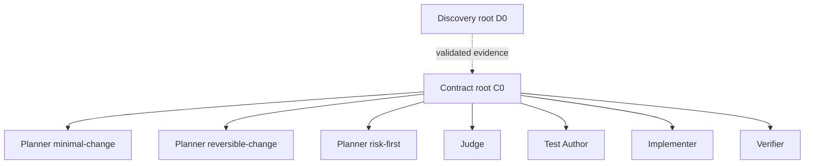

# Architecture

SafeChange is an explicit TypeScript orchestration pipeline around one long-lived
Codex App Server process. It avoids a generic workflow engine: each phase is an
async function with a persisted boundary and a schema-validated artifact.

## Context graph



D0 and C0 are separate `thread/start` roots. Every decision or write role is a
`thread/fork` from the immutable completed C0 turn. The Implementer receives the
selected plan as data and cannot inherit Planner discussion. The Verifier receives
the actual diff and deterministic results and cannot inherit Implementer history.

## Data flow

1. `workflow.ts` checks the baseline, runs D0 and C0, forks planners, applies pure
   eligibility rules, and asks the Judge to select one eligible plan.
2. `harness.ts` revalidates B0, creates the SafeChange branch, forks Test Author,
   validates its test-only diff, proves the baseline signal, commits T1, and stores
   hashes of every protected path.
3. `implementation.ts` forks Implementer, validates actual paths, commits I1, runs
   deterministic checks, and forks an independent Verifier. One local repair may
   resume the same Implementer before a fresh Verifier fork.
4. `orchestrator.ts` validates persisted boundaries and applies the final release
   gate before emitting `VERIFIED`.

```text
task -> evidence -> contract -> plans -> eligibility -> decision
     -> harness/T1 -> implementation/I1 -> commands -> verification -> report
```

## Sources of truth

- Git commit ids, branch, status, paths, and diffs.
- Atomic artifact envelopes and SHA-256 hashes.
- JSON Schemas validated locally with Ajv.
- Structured command argv, real exit codes, timeouts, and bounded output.
- Explicit App Server thread ids, turn ids, parent C0 id, and checkpoint turn id.

Model statements are proposals or findings, never sufficient proof of success.

## Runtime boundary

`AppServerClient` is a thin JSONL client, not an SDK. It implements initialization,
request correlation, concurrent responses, thread start/fork/resume, turn completion,
timeouts, interruption, and process failure. TypeScript declarations and JSON Schemas
are generated from the exact Codex version recorded in `protocol-version.json`.

Repository commands are independent child processes wrapped by the Codex sandbox.
They are allowlisted, non-interactive, network-disabled, and run with a sanitized
environment. See [`THREAT_MODEL.md`](THREAT_MODEL.md) for the limits of this boundary.

## Persistence and recovery

`.safechange/runs/<run-id>/state.json` records the last completed boundary. Resume is
allowed only after planning, T1, or independent verification. Before reuse,
SafeChange checks protocol equality, artifact hashes and schemas, role lineage, Git
branch and HEAD, baseline ancestry, protected configuration metadata, and T1 hashes.

Failures keep the branch, working tree, and artifacts inspectable. SafeChange does
not claim automatic rollback or clean up user state.

## Extension rule

New abstractions require a current second use case. Additional ecosystems, providers,
worktrees, hosted services, and UI surfaces remain outside the core until the existing
vertical workflow demonstrates a concrete need.
